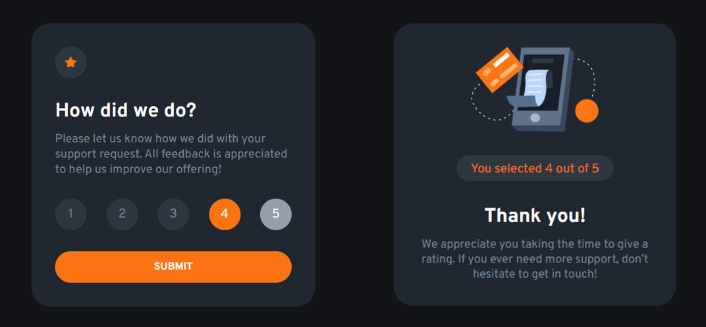

# Frontend Mentor - Interactive rating component solution

This is a solution to the [Interactive rating component challenge on Frontend Mentor](https://www.frontendmentor.io/challenges/interactive-rating-component-koxpeBUmI). Frontend Mentor challenges help you improve your coding skills by building realistic projects.

## Table of contents

- [Overview](#overview)
  - [The challenge](#the-challenge)
  - [Screenshot](#screenshot)
  - [Links](#links)
- [My process](#my-process)
  - [Built with](#built-with)
  - [What I learned](#what-i-learned)
  - [Continued development](#continued-development)
  - [Useful resources](#useful-resources)

## Overview

### The challenge

Users should be able to:

- View the optimal layout for the app depending on their device's screen size
- See hover states for all interactive elements on the page
- Select and submit a number rating
- See the "Thank you" card state after submitting a rating

### Screenshot

### Links

- Solution URL: [Solution](https://github.com/CVakratsas/Frontend-Mentor/tree/master/02_InteractiveRatingComponent/solution)

## My process

### Built with

- Semantic HTML5 markup
- CSS custom properties
- Flexbox
- Prettier(Code formatter)

### What I learned

I got more accustomed with the CSS selectors, I tried to create reusable CSS classes and I converted divs into radio buttons. Furthermore, I used JS for the first time in a project and I dowloaded Prettier - a code formatter which is used to structure your code evenly.

### Continued development

I feel confident using the flexbox to align items so I will aim to use the gridbox for the next project.

### Useful resources

- [Using divs as radio buttons](https://stackoverflow.com/questions/32935435/use-div-as-radio-button) - This was the approach I used for the circular ratting radio buttons.
