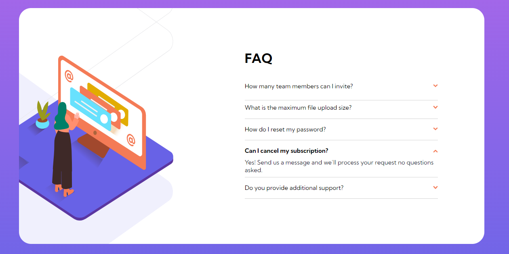

# Frontend Mentor - FAQ accordion card solution

This is a solution to the [FAQ accordion card challenge on Frontend Mentor](https://www.frontendmentor.io/challenges/faq-accordion-card-XlyjD0Oam). Frontend Mentor challenges help you improve your coding skills by building realistic projects.

## Table of contents

- [Overview](#overview)
  - [The challenge](#the-challenge)
  - [Screenshot](#screenshot)
  - [Links](#links)
- [My process](#my-process)
  - [Built with](#built-with)
  - [What I learned](#what-i-learned)
  - [Continued development](#continued-development)
  - [Useful resources](#useful-resources)

## Overview

### The challenge

Users should be able to:

- View the optimal layout for the component depending on their device's screen size
- See hover states for all interactive elements on the page
- Hide/Show the answer to a question when the question is clicked

### Screenshot

### Links

- Solution URL: [Solution](https://cvakratsas.github.io/Frontend-Mentor/03_FAQ_Accordion_Card/solution/index.html)

## My process

### Built with

- Semantic HTML5 markup
- CSS custom properties
- Flexbox
- Functionality only with CSS

### What I learned

Had some practice with the relative units of measurement (rem, vh, vw etc.). Furthermore, I learned about transitions and how to apply them.

### Continued development

I am looking forward to honing my CSS skills so that I can create more projects without the use of JS.

### Useful resources

- [Anchor tag FAQ](https://www.youtube.com/watch?v=MXrtXg1kpVs) - Youtube video about creating a FAQ by using <a> tags for the questions and the :target pseudo-class for the hide/show functionality.
